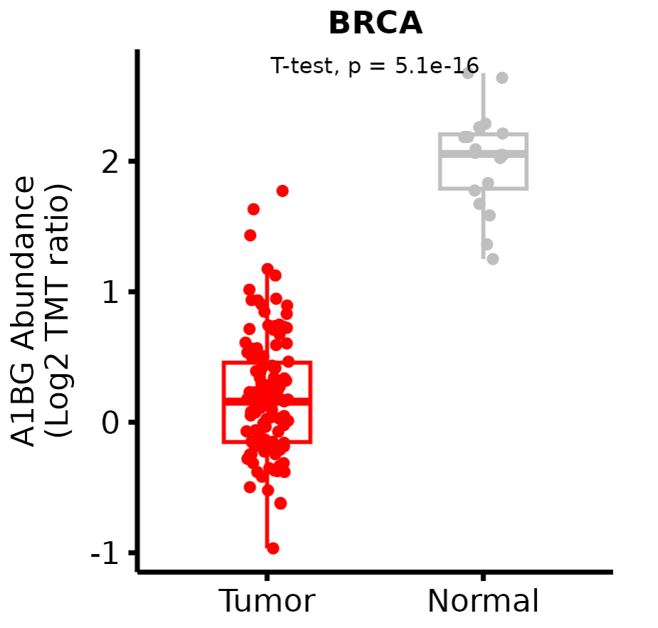

# Overview

iProPhos can perform proteomics-related and phosphoproteomics-related analyses.

# Proteome Analysis

### Differential expression

This feature allows users to explore and compare the expression patterns of their interested proteins across tumor and normal samples.

#### Boxplot

iProPhos  generates boxplots with jitter and allows users to customize box color, point size and statistical methods.

#### Parameters

- **Dataset:** Select a cancer type of interest.

- **Protein:** Input a protein of interest. `Note:` The available proteins in each dataset vary. Only 1000 proteins from the respective dataset are shown in the dropdown list, and users can also manually input proteins with auto-completion.

- **Tumor color:** Set the box color in tumor samples.

- **Normal color:** Set the box color in normal samples.

- **Point Size:** Set the point size.

- **Differential Methods:** Select a method for differential analysis.

  - t-test: two-tailed test, assuming unequal variances. 

  - wilcox.test: Wilcoxon rank-sum test.

  - anova: assuming equal variances.

    The t-test is appropriate when the data is normally distributed.  The Wilcoxon test is suitable when the data does not meet the assumptions of normality. ANOVA is useful when assuming normality and equal variances.  The choice of the appropriate test should be based on the specific characteristics of the data.
    
    This analysis is not corrected for multiple testing.

#### Results

#### Volcano plot

iProPhos generates volcano plots and allows users to set the cutoff value to define significance.

#### Parameters

- **Dataset:** Select a cancer type of interest.

[For plot]

- **Protein:** Input a protein of interest. 
- **FDR cutoff:** Input the adjusted p-value  cutoff.
- **|log2FC| cutoff:** Input the |log2(fold change)| cutoff. This value should be greater than 0.

#### Results

#### Plot

Upregulated and downregulated proteins in tumor samples are labeled orange and blue respectively, while gray means non-significance. Moreover, the interested protein can be magnified and highlighted with its gene symbol. 

#### Table
This table (ranked by |logFC|) provides a concise summary of the differential analysis results using the limma algorithm.

### Correlation analysis

iProPhos allows users to evaluate protein expression correlations with scatter plots or tables.

#### Correlation plot

This feature investigates the correlation  between two interested proteins in the specific tumor.

#### Parameters

- **Dataset:** Select a cancer type of interest.

- **Protein A:** Input a protein A of interest. [For x-axis]

- **Protein B:** Input a protein B of interest. [For y-axis]

- **Color for non-imputed data:** Set the point color for non-imputed data.

- **Color for imputed data:** Set the point color for KNN imputed data.

- **Point Size:** Set the point size.

- **Method:** Select a method for the correlation test.
  
  - pearson: Pearson correlation assumes that the variables are normally distributed and have a linear relationship.
  
  - spearman: Spearman correlation assesses the non-linear relationship between two variables. It is useful when the data may not meet the assumptions of Pearson correlation.
  
  - kendall:  Kendall correlation is a non-parametric correlation measure that assesses the strength of association between two variables without assuming linearity. 
  
    This analysis is not corrected for multiple testing.

#### Results

#### Correlation table

This table shows the correlation of the target protein with other proteins in the selected dataset.

#### Parameters

- **Dataset:** Select a cancer type of interest.

- **Protein:** Input a protein of interest. 
- **Method:** Select a method for the correlation test.

#### Results

Correlation analysis provides results both with and without imputation. The table has been ranked by the correlation coefficient, and p-values have been adjusted using the Benjamini-Hochberg (BH) method.

**Using non-imputed dataset**

**Using imputed dataset**

The missing values  have been imputed using KNN algorithm. 

### Survival

This feature enables the identification of potential biomarkers which significantly associate with clinical outcome. iProPhos  performs overall survival (OS) analysis based on protein abundance. Log-rank test has been used for hypothesis test.

#### Parameter

- **Dataset:** Select a cancer type of interest.

- **Protein:** Input a protein of interest. 

- **"Group: High" color:** Choose the color for the high-expression group.

- **"Group: Low" color:** Choose the color for the low-expression group.

- **Group Cutoff:** Select an appropriate expression threshold to divide patients into high-expression and low-expression groups. Median means the median value of protein abundance, and optimal value is determined by the surv_cutpoint algorithm, which exhibits the most significant association with survival.

  This analysis is not corrected for multiple testing.

#### Results

### mRNA&Protein Correlation

iProPhos performs correlation analysis between mRNA and protein abundances in specific cancer type.

#### Parameters

- **Dataset:** Select a cancer type of interest.

- **Gene:** Input a gene of interest. 

- **Color for non-imputed data:** Set the point color for non-imputed data.

- **Color for imputed data:** Set the point color for KNN imputed data.

- **Point Size:** Set the point size.

- **Method:** Select a method for the correlation test.

  - pearson: Pearson correlation assumes that the variables are normally distributed and have a linear relationship.

  - spearman: Spearman correlation assesses the non-linear relationship between two variables. It is useful when the data may not meet the assumptions of Pearson correlation.

  - kendall:  Kendall correlation is a non-parametric correlation measure that assesses the strength of association between two variables without assuming linearity. 

    This analysis is not corrected for multiple testing.

#### Results

### Clinical

iProPhos investigates the association between protein abundance and clinical features, such as age, gender and tumor stage.

#### Age

#### Parameters

- **Dataset:** Select a cancer type of interest. The age ranges of patients in the specific datasets have been labeled.

- **Protein:** Input a protein of interest. 

- **Younger color:** Set the violin color for young patients.

- **Older color:** Set the violin color for old patients.

- **Method:** Choose an appropriate method to classify patients into young and old groups. Median means the median age of patients. When users select custom method, they can input a suitable number as the cutoff value.

- **Differential Methods:** Select a method for differential analysis.

  - t-test: two-tailed test, assuming unequal variances. 

  - wilcox.test: Wilcoxon rank-sum test.

  - anova: assuming equal variances.

    The t-test is appropriate when the data is normally distributed.  The Wilcoxon test is suitable when the data does not meet the assumptions of normality. ANOVA is useful when assuming normality and equal variances.  The choice of the appropriate test should be based on the specific characteristics of the data.

    This analysis is not corrected for multiple testing.

#### Results

#### Gender

- **Dataset:** Select a cancer type of interest. 

- **Protein:** Input a protein of interest.

- **Female color:** Set the violin color for female patients.

- **Male color:** Set the violin color for male patients.

- **Differential Methods:** Select a method for differential analysis.

  This analysis is not corrected for multiple testing.

#### Results

#### Tumor stage

- **Protein:** Input a protein of interest. 

- **Dataset:** Select a cancer type of interest.

The method for differential analysis is `one-way ANOVA`, using tumor stage as variable for calculating protein differential expression.

This analysis is not corrected for multiple testing.

#### Results

### Enrichment

iProPhos performs over-representation analysis (ORA) and gene set enrichment analysis (GSEA) to identify dysregulated pathways. The enrichment analyses are based on the results of differential expression analysis using the limma algorithm. ORA analysis includes Gene Ontology (GO) and Kyoto Encyclopedia of Genes and Genomes (KEGG) enrichment analyses.

#### GO enrichment

#### Parameter

- **Dataset:** Select a cancer type of interest.
- **Regulation:** Select the up-regulated or down-regulated proteins in the tumor.
- **adjusted P-value cutoff:** Set the cutoff value for the adjusted p-value (BH correction).
- **Fold change cutoff:** Set the cutoff value for the fold change (tumor vs normal).

#### Results

The redundant GO terms are removed to present the most informative terms with simplify algorithm. 

The graphic results show the top10 enriched annotations for biological process (BP), cellular component (CC) and molecular function (MF). iProPhos also provides  a complete list of GO enrichment results for download.

#### KEGG enrichment

#### Parameter

- **Dataset:** Select a cancer type of interest.
- **Regulation:** Select the up-regulated or down-regulated proteins in the tumor.
- **adjusted P-value cutoff:** Set the cutoff value for the adjusted p-value (BH correction).
- **Fold change cutoff:** Set the cutoff value for the fold change (tumor vs normal).

#### Results

The graphic results show the top10 enriched KEGG annotations. iProPhos also provides  a complete list of KEGG enrichment results for download.

#### GSEA

#### Parameter

- **Gene list:** Input  the gene list of interest, separated by commas.
- **Dataset:** Select a cancer type of interest.

#### Results

### PPI

iProPhos generates an interactive network diagram of protein interactions (including both physical and functional interactions) to performs the protein-protein interaction (PPI) network analysis. The PPI network analysis is based on the results of differential expression analysis using the limma algorithm. 

#### Parameter

- **Dataset:** Select a cancer type of interest.
- **Regulation:** Select the up-regulated or down-regulated proteins in the tumor.
- **adjusted P-value cutoff:** Set the cutoff value for the adjusted p-value (BH correction).
- **Fold change cutoff:** Set the cutoff value for the fold change (tumor vs normal).

#### Results

Nodes represent proteins, and edges represent their interactions, with thicker edges indicating higher confidence of interactions. Users can download the results in a tabular format for further analysis in Cytoscape or other similar software.

## Phosphoproteome Analysis

This module aims to do phosphoproteomics-related analysis and integrate with proteomics data. Differential analysis and clinical features-related analysis are the same as those in the  `Proteome Analysis` module. Therefore, these features will not be repeated  here. 

### Correlation

This feature investigates correlations between protein abundance and the phosphorylation levels of phosphosites.

#### Parameter

- **Dataset:** Select a cancer type of interest.

- **Protein:** Input a protein of interest. 

- **Site:** Input the phosphosite of interest.

- **Color for non-imputed data:** Set the point color for non-imputed data.

- **Color for imputed data:** Set the point color for KNN imputed data.

- **Point Size:** Set the point size.

- **Method:** Select a method for the correlation test.

  - pearson: Pearson correlation assumes that the variables are normally distributed and have a linear relationship.

  - spearman: Spearman correlation assesses the non-linear relationship between two variables. It is useful when the data may not meet the assumptions of Pearson correlation.

  - kendall:  Kendall correlation is a non-parametric correlation measure that assesses the strength of association between two variables without assuming linearity. 

    This analysis is not corrected for multiple testing.

#### Results

### Kinase-substrate Correlation

This feature investigates correlations between protein abundance of kinases and phosphorylation level of substrates. Results have been ordered by correlation coefficient.

#### Parameter

- **Dataset:** Select a cancer type of interest.

- **Kinase:** Select one kinase of interest.
  
  The list of kinases was collected from the PhosphoSitePlus (http://www.phosphosite.org) and NetworKIN (https://networkin.info/).
  
- **Method: **Select a method for the correlation test.

#### Results

Results are provided both with and without imputation. The table has been ranked by the correlation coefficient, and p-values have been adjusted using the BH correction.

**Using non-imputed dataset**

**Using imputed dataset**

The missing values  have been imputed using KNN algorithm. 

### Kinase-Substrate Enrichment

iProPhos estimates changes in a kinase’s activity based on the collective phosphorylation changes of its identified substrates using kinase-substrate enrichment analysis (KSEA) algorithm. The following annotations refer to Wiredja D.D. et al publication.

#### Parameter

- **Dataset：** Select a cancer type of interest.

- **Kinase-substrate dataset:** Choose the data sources of kinase-substrate relationship.
PhosphoSitePlus: PhosphoSitePlus only includes experimentally verified kinase-substrate relationships, which is recommended for the more conservative results.
PhosphoSitePlus + NetworKIN: NetworKIN provides predicted relationships. Users can choose this option to score more kinases. Once selected, users should set a NetworKIN score cutoff, which indicates that higher scores have more confident kinase and substrate prediction.

- **[for plot] p-value cutoff:** Set p-value cutoff to mark the statistically significant kinases in the bar plot. Red means significantly positive scores and blue means significantly negative scores, whereas black means insignificant. The value of scores implies the overall change of kinase activity relative to normal samples.

- **[for plot] Substrate count cutoff:** Set the minimal substrates which correspond to a kinase in the bar plot. A lower cutoff thus allows more kinases into the bar plot.

#### Results

#### Kinase Barplot
Show the kinase scores in the form of bar plot. Note: not all kinases in this bar plot, it is decided by `the substrate count cutoff` option.

#### Kinase scores

This table lists all kinases which have at least one identified substrate in the selected dataset, thus also includes kinases not marked in the bar plot.
Please refer to the original Casado et al. publication for detailed description what these columns represent.

- **Kinase.Gene:** the gene name of each kinase.
  
- **mS:** the mean log2(fold change) of all the kinase's substrates.
  
- **Enrichment:** the background-adjusted value of the kinase's mS.
  
- **m:** the total amount of detected substrates from the kinase-substrate dataset for each kinase.
  
- **z.score:** the normalized score for each kinase, weighted by the number of identified substrates.
  
- **p.value:** the statistical assessment for the z.score.
  
- **FDR:** the p-value adjusted for multiple hypothesis testing using the BH method.

#### Kinase-Substrate Link

This table lists all the kinase and substrate relationships identified from the selected dataset. It also includes relationships for kinases not marked in the bar plot.

- **Kinase.Gene:** the gene name for each kinase.

- **Substrate.Gene:** the gene name for each substrate linked to that kinase.

- **Substrate.Mod:** the substrate's specific amino acid residue that was modified.

- **Source:** the database where the kinase-substrate annotation was derived from.

- **log2FC:** the log2(fold change) value of that particular phosphosite.

### Survival

This feature can find the potential phosphosites significantly correlated with overall survival (OS). Log-rank test has been used for hypothesis test.

#### Survival plot

This feature provides OS analysis of one interested phosphosite with the Kaplan-Meier survival curve plot.

#### Parameter

- **Dataset:** Select a cancer type of interest.
- **Phosphosite:** Input one phosphosite of interest. 
- **"Group: High" color:** Choose the color for the group with high phosphorylation levels.
- **"Group: Low" color:** Choose the color for the group with low phosphorylation levels.
- **Group Cutoff:** Choose an appropriate threshold of phosphorylation levels to separate patients into the groups with high and low phosphorylation levels. Median means the median value of phosphorylation levels, and optimal value is determined by the `surv_cutpoint` algorithm that exhibits the most significant association with survival.

#### Results

#### Survival table

This feature provides OS analysis of all detected phosphosites in a given protein in the selected dataset. With this function, users could easily select the phosphosites that significantly correlated with survival outcomes for further research.
This feature uses the median value of phosphorylation levels as the cutoff to categorize patients into high and low phosphorylation level groups.

#### Parameter

- **Dataset:** Select a cancer type of interest.

- **Protein:** Input the protein of interest. 

#### Result

## User upload
users can  upload their own proteomics/phosphoproteomics data for analysis and visualization.

### File upload
**[Required]**

- proteomics/phosphoproteomics data

- sample group imformation

**[Optional]**

- patient survival information

#### Data format:

Both `txt` and `csv` formats of files are acceptable.

#### Proteomics data

Please upload the file format like this:

For the first column, please input `gene symbols` of proteins.

#### Phosphoproteomics data

Please upload the file format like this:

For the first column, please input `gene symbol_phosphosites` .

#### Note:

The size of the uploaded file should not exceed `60M` .

The uploaded proteomics/phosphoproteomics data should be `pre-processed and normalized` .

#### Sample group
Please upload the file format like this:

- **case_id:** Keep  the same number and sample names as those in the proteomics/phosphoproteomics data.

- **class:** Sample classification, including two categories: `Tumor/Normal` . If there is no normal group, you should fill in `Tumor` for all samples.

#### Survival information
Please upload the file format like this:

- **Case_id:** Match the "case_id" of `tumor samples` in the sample group file.
- **OS:** Overall survival time. It refers to the length of time from a specific event (such as diagnosis or treatment initiation) until the patient's death from any cause or the end of the study period.
- **Status:** Patient's survival status. Status 1 = dead, 0 = alive or censored.

If the patient's survival information is missing, fill it with `NA` .